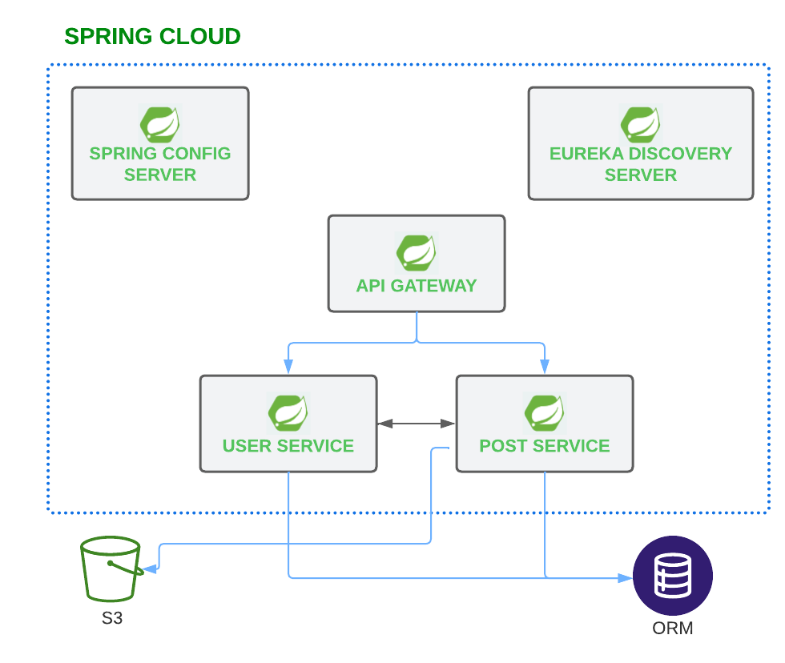
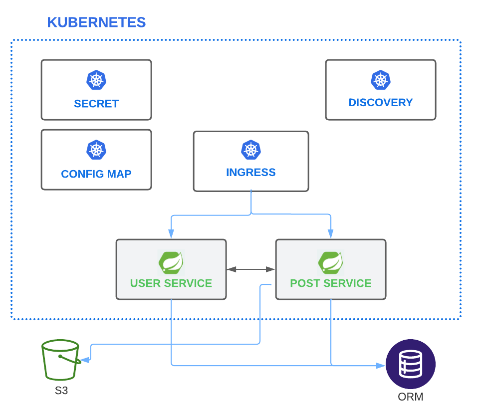

# Posterr Spring Boot Microservices API 


### TLDR
#### If you are getting the .zip file just run:

```bash
# run docker-compose
$ docker-compose up --build
```

# 🧠 About

Rest API built with Spring Framework using microservices architecture. 

## 🧪 Technologies

- Java
- Spring Boot
- Spring Cloud Gateway
- Discovery Server Eureka
- OpenFeign
- Ribbon
- Postgres
- Docker

## 🚀 How to run

If you want to recompile and build the artifacts:

```bash
# run docker-compose
$ ./mvnw clean install
```

After run last command or if you get the .zip pack just run:

```bash
# run docker-compose
$ docker-compose up --build
```
### 📚 Api Documentation

[http://localhost:8080/swagger-ui/#](http://localhost:8080/swagger-ui/#)

##### Eureka monitor 

[http://localhost:8761/](http://localhost:8761/)


### Connect to postgres database on
- localhost:5432 / postgres:postgres / posterr

# Critique

Because the test doesn't ask for authentication(that will be provided after), the user that create a post, repost or quote, need to be sendend in the post's boddy or query param, if not it is getted ramdomly in the user microsevice. 
To improve this, I would build an oauth2 microservice that will be used to authenticate the user, or chage the gateway to work as OAuth 2.0 Resource Server.

For the purpose of this test I used Eureka to register the microservices and Spring Cloud Gateway. But they can be replaced by kubernetes discovery and Ingress as gateway.



